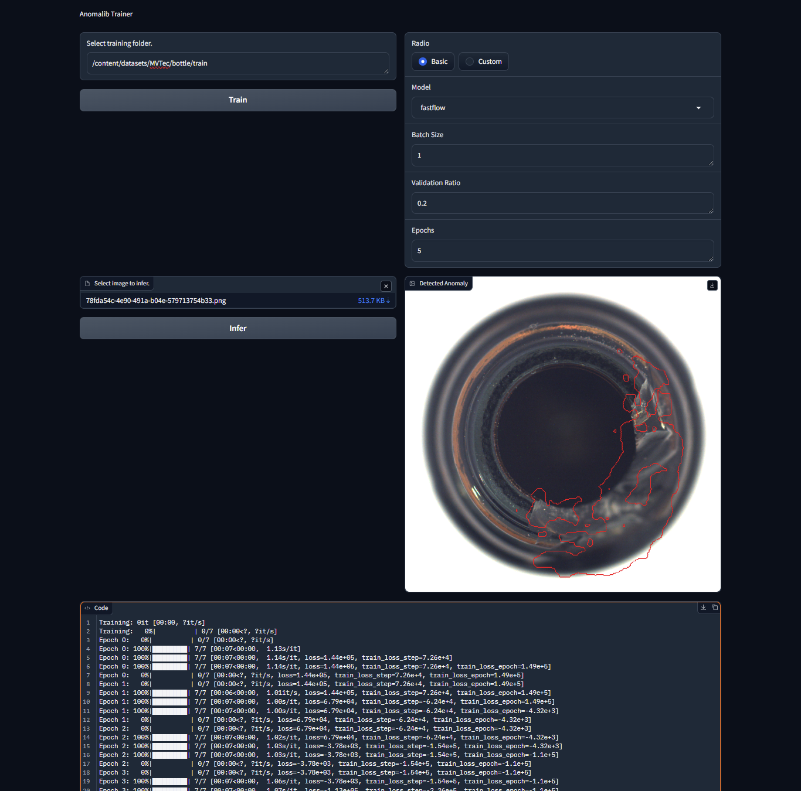

# Anomalib-Trainer

A simple Gradio interface for training [Anomalib](https://github.com/openvinotoolkit/anomalib) models.



## Usage

1. Install dependencies

    ````bash
    pip3 install -r requirements.txt
    ````

2. Run the app

    ````bash
    python3 app.py
    ````

3. Specify your dataset location by entering the path to the folder container
   `abnormal` and `normal` images. The folders should have those names.

4. You can either use the Basic config, or provide your own `config.yaml` at Custom config mode.